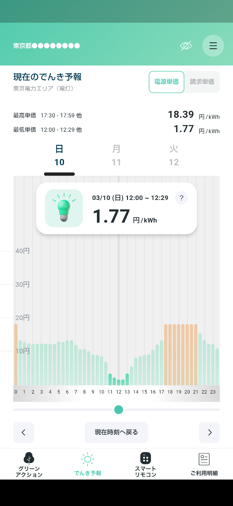

# btlooop
市場連動型電気料金プラン追従の蓄電池スケジュール設定
==================

## About btlooop
Looopでんきのでんき予報より設定料金によりEchonetLightで蓄電池をスケジュール制御します。

Looopでんき　でんき予報 
https://looop-denki.com/home/denkiforecast/

ECHONET Lite規格書　蓄電池・HEMSコントローラ間 
https://echonet.jp/wp/wp-content/uploads/pdf/General/Standard/AIF/sb/sb_aif_ver1.30.pdf

## Usage

■実行環境  
* Python3  
* atコマンド(linux等のshellコマンド)

------------------------------------------------

BTDef.pyの蓄電池IPアドレスを設定します。
<pre>
# 蓄電池IPアドレス
BT_ADDR = '192.168.0.xx'
</pre>
※ホームサーバやルータの設定でIPアドレス固定にしておくと良いです。

------------------------------------------------

充電 or 放電する単価の閾値をbtsch.shに設定します。 
以下例では単価10.8円未満で充電し、18.2円超えると放電します。

<pre>
#放電電源単価閾値
HI_LIMIT=18.2
#充電電源単価閾値
LO_LIMIT=10.8
</pre>

------------------------------------------------

# 実行例  
<pre>
$ ./btsch.sh
18.2 11.23
Job 104 will be executed using /bin/sh
Job 105 will be executed using /bin/sh
：

</pre>

------------------------------------------------
ECHONET Lite　コマンド等
<pre>
プロパティ値取得要求／応答待ち
$ python3 bt/BTGet.py
cf      44:待機 運転動作状態
da      44:待機 運転モード
a4      3224 Wh AC充電可能量
e2      6166 Wh 蓄電残量
e4      68%     蓄電残量

運転モード設定要求
$ python3 bt/BTSet.py
2024/03/11 21:29 ['bt/BTSet.py']
usage: BTSet.py cmd
{'42': '充電', '43': '放電', '44': '待機'}

</pre>

------------------------------------------------

